# Demo 2026 

## Table of Contents

 
  - [**Модуль 1. Настройка сетевой инфраструктуры**](#модуль-1-настройка-сетевой-инфраструктуры)
  - [Задание 1. Произведите базовую настройку устройств:](#задание-1-произведите-базовую-настройку-устройств)
  - [Задание 2. Настройте доступ к сети Интернет, на маршрутизаторе ISP:](#задание-2-настройте-доступ-к-сети-интернет-на-маршрутизаторе-isp)
  - [Задание 3. Создайте локальные учетные записи на серверах HQ-SRV и BR-SRV:](#задание-3-создайте-локальные-учетные-записи-на-серверах-hq-srv-и-br-srv)
  - [Задание 4. Настройте коммутацию в сегменте HQ следующим образом:](#задание-4-настройте-коммутацию-в-сегменте-hq-следующим-образом)
  - [Задание 5. Настройте безопасный удаленный доступ на серверах HQ-SRV и BR-SRV:](#задание-5-настройте-безопасный-удаленный-доступ-на-серверах-hq-srv-и-br-srv)
  - [Задание 6. Между офисами HQ и BR, на маршрутизаторах HQ-RTR и BR-RTR необходимо сконфигурировать ip туннель](#задание-6-между-офисами-hq-и-br-на-маршрутизаторах-hq-rtr-и-br-rtr-необходимо-сконфигурировать-ip-туннель)
  - [Задание 7. Обеспечьте динамическую маршрутизацию на маршрутизаторах HQ-RTR и BR-RTR: сети одного офиса должны быть доступны из другого офиса и наоборот.](#задание-7-обеспечьте-динамическую-маршрутизацию-на-маршрутизаторах-hq-rtr-и-br-rtr-сети-одного-офиса-должны-быть-доступны-из-другого-офиса-и-наоборот)
  - [Задание 8. Настройка динамической трансляции адресов маршрутизаторах HQ-RTR и BR-RTR:](#задание-8-настройка-динамической-трансляции-адресов-маршрутизаторах-hq-rtr-и-br-rtr)
  - [Задание 9. Настройте протокол динамической конфигурации хостов для сети в сторону HQ-CLI:](#задание-9-настройте-протокол-динамической-конфигурации-хостов-для-сети-в-сторону-hq-cli)
  - [Задание 10.Настройте инфраструктуру разрешения доменных имён для офисов HQ и BR:](#задание-10настройте-инфраструктуру-разрешения-доменных-имён-для-офисов-hq-и-br)
   
  - [**Модуль 2. Организация сетевого администрирования**](#модуль-2-организация-сетевого-администрирования)
  - [Задание 1. Настройте контроллер домена Samba DC на сервере BR-SRV:](#задание-1-настройте-контроллер-домена-samba-dc-на-сервере-br-srv)
  - [Задание 2. Сконфигурируйте файловое хранилище на сервере HQ-SRV](#задание-2-сконфигурируйте-файловое-хранилище-на-сервере-hq-srv)
  - [Задание 3. Настройте сервер сетевой файловой системы (nfs) на HQ-SRV:](#задание-3-настройте-сервер-сетевой-файловой-системы-nfs-на-hq-srv)
  - [Задание 4. Настройте службу сетевого времени на базе сервиса chrony на маршрутизаторе ISP:](#задание-4-настройте-службу-сетевого-времени-на-базе-сервиса-chrony-на-маршрутизаторе-isp)
  - [Задание 5. Сконфигурируйте ansible на сервере BR-SRV:](#задание-5-сконфигурируйте-ansible-на-сервере-br-srv)
  - [Задание 6. Разверните веб приложение в docker на сервере BR-SRV:](#задание-6-разверните-веб-приложение-в-docker-на-сервере-br-srv)
  - [Задание 7. Разверните веб приложение на сервере HQ-SRV:](#задание-7-разверните-веб-приложение-на-сервере-hq-srv)
  - [Задание 8. На маршрутизаторах сконфигурируйте статическую трансляцию портов](#задание-8-на-маршрутизаторах-сконфигурируйте-статическую-трансляцию-портов)
  - [Задание 9. Настройте веб-сервер nginx как обратный прокси-сервер на ISP](#задание-9-настройте-веб-сервер-nginx-как-обратный-прокси-сервер-на-isp)
  - [Задание 10. На маршрутизаторе ISP настройте web-based аутентификацию](#задание-10-на-маршрутизаторе-isp-настройте-web-based-аутентификацию)
  - [Задание 11.Удобным способом установите приложение Яндекс Браузер на HQ-CLI](#задание-11удобным-способом-установите-приложение-яндекс-браузер-на-hq-cli)
    
  - [**Модуль 3 Эксплуатация объектов сетевой инфраструктуры**](#модуль-3-эксплуатация-объектов-сетевой-инфраструктуры)
  - [Задание 1. Выполните импорт пользователей в домен au-team.irpo.](#задание-1-выполните-импорт-пользователей-в-домен-au-teamirpo)
  - [Задание 2. Выполните настройку центра сертификации на базе HQ-SRV](#задание-2-выполните-настройку-центра-сертификации-на-базе-hq-srv)
  - [Задание 3. Перенастройте ip-туннель с базового до уровня туннеля, обеспечивающего шифрование трафика](#задание-3-перенастройте-ip-туннель-с-базового-до-уровня-туннеля-обеспечивающего-шифрование-трафика)
  - [Задание 4. Настройте межсетевой экран на маршрутизаторах HQ-RTR и BR-RTR на сеть в сторону ISP.](#задание-4-настройте-межсетевой-экран-на-маршрутизаторах-hq-rtr-и-br-rtr-на-сеть-в-сторону-isp)
  - [Задание 5. Настройте принт-сервер cups на сервере HQ-SRV:](#задание-5-настройте-принт-сервер-cups-на-сервере-hq-srv)
  - [Задание 6. Реализуйте логирование при помощи rsyslog на устройствах HQ-RTR, BR-RTR, BR-SRV:](#задание-6-реализуйте-логирование-при-помощи-rsyslog-на-устройствах-hq-rtr-br-rtr-br-srv)
  - [Задание 7. Насервере HQ-SRV реализуйте мониторинг устройств с помощью открытого программного обеспечения](#задание-7-насервере-hq-srv-реализуйте-мониторинг-устройств-с-помощью-открытого-программного-обеспечения)
  - [Задание 8. Реализуйте механизм инвентаризации машин HQ-SRV и HQ-CLI через Ansible на BR-SRV:](#задание-8-реализуйте-механизм-инвентаризации-машин-hq-srv-и-hq-cli-через-ansible-на-br-srv)
  - [Задание 9. На HQ-SRV настройте программное обеспечение fail2ban для защиты ssh](#задание-9-на-hq-srv-настройте-программное-обеспечение-fail2ban-для-защиты-ssh)
  - [Задание 10 Настройка резервного копирования директории сервера HQ-SRV:](#задание-10-настройка-резервного-копирования-директории-сервера-hq-srv)

***Вкладка 1***

Демонстрационный экзамен ССА 2026

Топология сети:

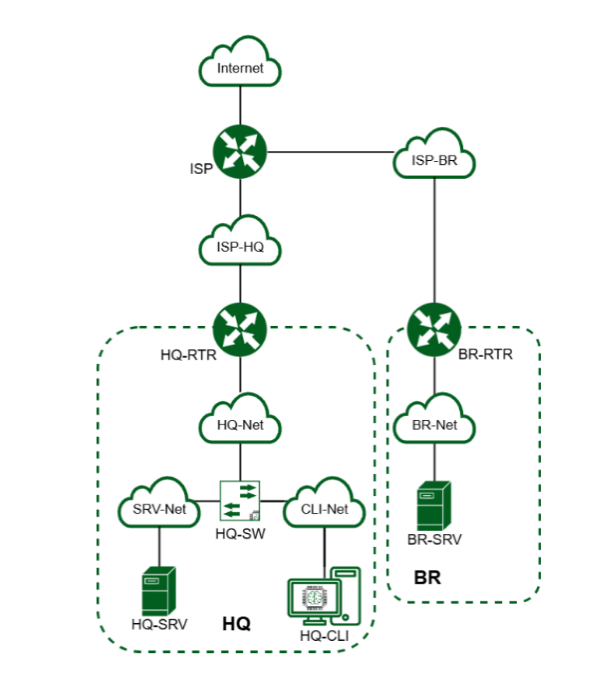
Используемые ОС:

ISP, HQ-RTR, BR-RTR - Astra Linux CE

HQ-SRV, BR-SRV - Альт Сервер 10

HQ-CLI - Альт Рабочая станция 10

Ссылки на образы ОС:

Astra Linux:

[**https://dl.astralinux.ru/astra/stable/2.12_x86-64/iso/alce-2.12.46.6-17.04.2023_15.09.iso**](https://dl.astralinux.ru/astra/stable/2.12_x86-64/iso/alce-2.12.46.6-17.04.2023_15.09.iso)

Альт Сервер:

[**https://download.basealt.ru/pub/distributions/ALTLinux/p10/images/server/x86_64/alt-server-10.4-x86_64.iso**](https://download.basealt.ru/pub/distributions/ALTLinux/p10/images/server/x86_64/alt-server-10.4-x86_64.iso)

Альт Рабочая станция:

[**https://download.basealt.ru/pub/distributions/ALTLinux/p10/images/workstation/x86_64/alt-workstation-10.1-x86_64.iso**](https://download.basealt.ru/pub/distributions/ALTLinux/p10/images/workstation/x86_64/alt-workstation-10.1-x86_64.iso)

‘

Таблица адресации:

| ## **Устройство** | ## **Интерфейс** | ## **IP адрес** | ## **Маска подсети** | ## **Шлюз по умолчанию** |
| --- | --- | --- | --- | --- |
| ISP | eth0 | DHCP (автоматически) | - | DHCP (автоматически) |
| ISP | eth1 | 172.16.1.1/28 | 255.255.255.240 | - |
| ISP | eth2 | 172.16.2.1/28 | 255.255.255.240 | - |
| HQ-RTR | eth0 | 172.16.1.2/28 | 255.255.255.240 | 172.16.1.1 |
| HQ-RTR | eth1.100 | 192.168.1.1/27 | 255.255.255.224 | - |
| HQ-RTR | eth1.200 | 192.168.2.1/28 | 255.255.255.240 | - |
| HQ-RTR | eth1.999 | 192.168.99.1/29 | 255.255.255.248 | - |
| HQ-RTR | gre1 (ip tunnel) | 10.0.0.1/30 | 255.255.255.252 | - |
| HQ-SRV | ens18 | 192.168.1.2/27 | 255.255.255.224 | 192.168.1.1 |
| HQ-CLI | ens18 | DHCP (192.168.2.2/28) | 255.255.255.240 | DHCP (192.168.2.1) |
| BR-RTR | eth0 | 172.16.2.2/28 | 255.255.255.240 | 172.16.2.1 |
| BR-RTR | eth1 | 192.168.3.1/28 | 255.255.255.240 | - |
| BR-SRV | ens18 | 192.168.3.2/28 | 255.255.255.240 | 192.168.3.1 |

## **Модуль 1. Настройка сетевой инфраструктуры**

## Задание 1. Произведите базовую настройку устройств:

• Настройте имена устройств согласно топологии. Используйте полное

доменное имя.

ISP:

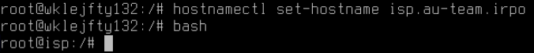
HQ-RTR:

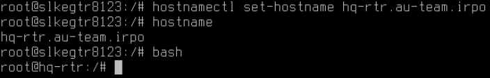
BR-RTR:

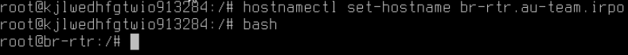

HQ-CLI:

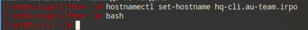
HQ-SRV:

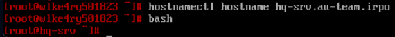
BR-SRV:

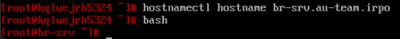
• На всех устройствах необходимо сконфигурировать IPv4:

• Локальная сеть в сторону HQ-SRV(VLAN 100) должна вмещать не более 32 адресов

• Локальная сеть в сторону HQ-CLI(VLAN 200) должна вмещать не менее 16 адресов

• Локальная сеть для управления(VLAN 999) должна вмещать не более 8 адресов

HQ-RTR:

открываем файл конфигурации сетевых интерфейсов

## **nano /etc/network/interfaces**

добавляем в конец файла следующие строки

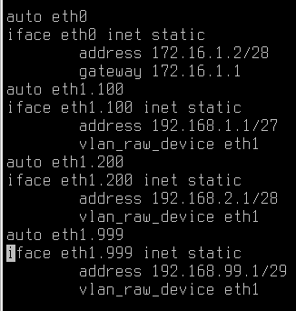
eth0 - интерфейс в сторону офиса ISP

eth1 - интерфейс в сторону офиса HQ

Перезагружаем сетевую службу

## **systemctl restart networking**

• Локальная сеть в сторону BR-SRV должна вмещать не более 16 адресов

BR-RTR:

открываем файл конфигурации сетевых интерфейсов

## **nano /etc/network/interfaces**

добавляем в конец файла следующие строки

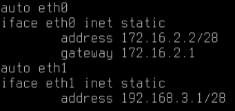
eth1 - интерфейс в сторону офиса BR

eth1 - интерфейс в сторону ISP

Перезагружаем сетевую службу

## **systemctl restart networking**

HQ-SRV:

Открываем файл конфигурации сетевого интерфейса

## **mcedit /etc/net/ifaces/ens18/options**

приводим файл к следующему виду

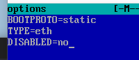
создаем файлы в директории интерфейса и приводим их к следующему виду

## **mcedit /etc/net/ifaces/ens18/ipv4address**

****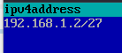

## **mcedit /etc/net/ifaces/ens18/ipv4route**

****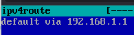

далее добавим vlan-тег к интерфейсу proxmox

дабл клик по интерфейсу машины

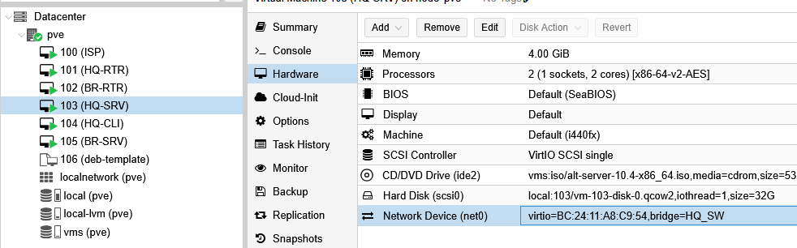
ставим VLAN Tag: 100

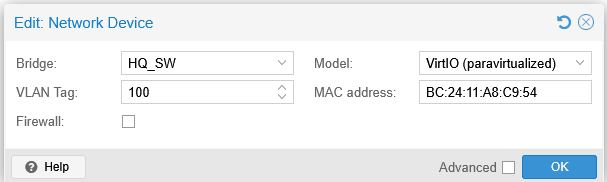

HQ-CLI:

Таким же образом ставим на интерфейсе клиента VLAN-тег 200.

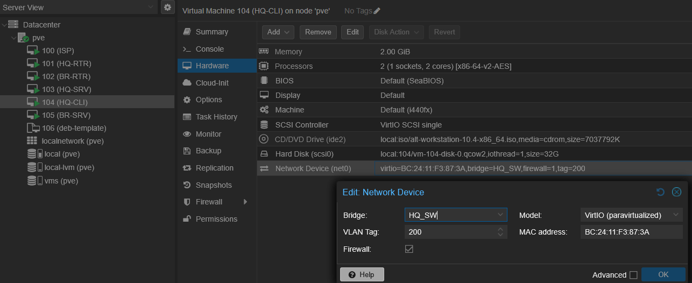
BR-SRV:

Открываем файл конфигурации сетевого интерфейса

## **mcedit /etc/net/ifaces/ens18/options**

приводим файл к следующему виду

создаем файлы в директории интерфейса и приводим их к следующему виду

## **mcedit /etc/net/ifaces/ens18/ipv4address**

****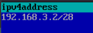

## **mcedit /etc/net/ifaces/ens18/ipv4route**

****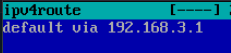

## Задание 2. Настройте доступ к сети Интернет, на маршрутизаторе ISP:

• Настройте адресацию на интерфейсах

открываем файл конфигурации сетевых интерфейсов

## **nano /etc/network/interfaces**

добавляем в конец файла следующие строки

****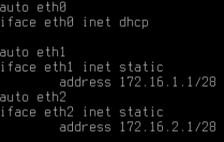

eth0 - интерфейс в сторону интернета

eth1 - интерфейс в сторону офиса HQ

eth2 - интерфейс в сторону офиса BR

Перезагружаем сетевую службу

## **systemctl restart networking**

для перекидывания пакетов между интерфейсами нужно произвести следующие операции

открываем sysctl.conf

## **nano /etc/sysctl.conf**

и добавляем в конец файла следующую строку

## **net.ipv4.ip_forward=1**

сохраняем файл и применяем введенное

**sysctl -p**

далее настроим NAT

**iptables -t nat -A POSTROUTING -o eth0 -j MASQUERADE**

Реализуем автозагрузку созданных правил

## **iptables-save > /etc/rules.v4**

после ввода данной команды открываем crontab следующей командо

## **crontab -e**

**Будет предложен выбор текстового редактора пишем 1 и нажимаем Enter**

добавляем в конец файла следующую строки:

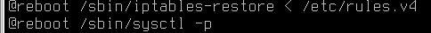

## Задание 3. Создайте локальные учетные записи на серверах HQ-SRV и BR-SRV:

• Создайте пользователя sshuser

• Пароль пользователя sshuser с паролем P@ssw0rd

• Идентификатор пользователя 2026

• Пользователь sshuser должен иметь возможность запускать sudo без ввода пароля

BR-SRV:

Для выполнения условий пишем следующие команды

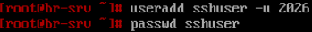
после чего дважды вводим задаваемый пароль

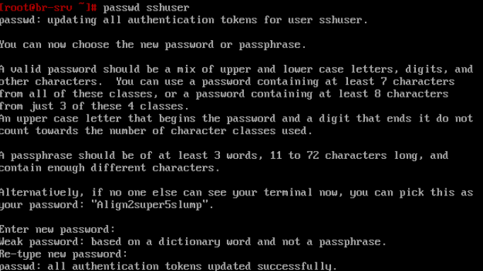
далее добавляем пользователя в группу wheel

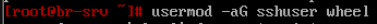
после чего меняем файл sudoers

## **mcedit /etc/sudoers**

после чего ищем данную строку и убираем знак комментария “#”

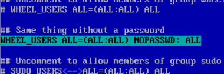
после чего выходим из редактора и сохраняем файл

для проверки авторизуемся как sshuser и пробуем выполнить любую sudo команду, после чего возвращаемся на рута

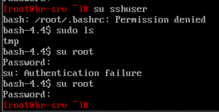
как видим пользователь требуемые функции работают

HQ-SRV:

Повторяем всё то же самое что и на BR-SRV

• Создайте пользователя net_admin на маршрутизаторах HQ-RTR и BR-RTR

• Пароль пользователя net_admin с паролем P@ssw0rd

• При настройке ОС на базе Linux, запускать sudo без ввода пароля

HQ-RTR:

Для выполнения условий пишем следующие команды

****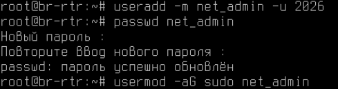

## **mkdir /home/net_admin**

далее отредактируем файл sudoers

## **nano /etc/sudoers**

находим строку, начинающуюся на “%sudo” и изменяем её значение на

****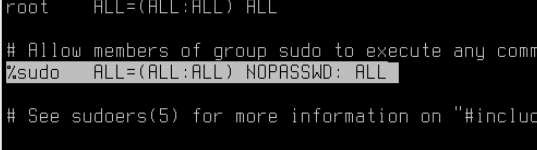

проверяем изменения

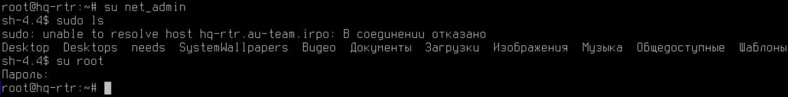
BR-RTR:

**Повторяем то же самое что и на HQ-RTR**

## Задание 4. Настройте коммутацию в сегменте HQ следующим образом:

• Трафик HQ-SRV должен принадлежать VLAN 100

• Трафик HQ-CLI должен принадлежать VLAN 200

• Предусмотреть возможность передачи трафика управления в VLAN 999

• Реализовать на HQ-RTR маршрутизацию трафика всех указанных VLAN с использованием одного сетевого адаптера ВМ/физического порта

так как мы уже ранее настроили интерфейсы машин с учетом VLAN - пропускаем этот пункт пропускается.

## Задание 5. Настройте безопасный удаленный доступ на серверах HQ-SRV и BR-SRV:

• Для подключения используйте порт 2026

• Разрешите подключения исключительно пользователю sshuser

• Ограничьте количество попыток входа до двух

• Настройте баннер «Authorized access only»

HQ-SRV:

открываем файл конфигурации sshd и вписываем туда параметры

## **mcedit /etc/openssh/sshd_config**

****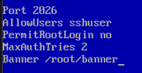

после сохраняем и закрываем файл

затем создаем файл баннера, в конце обязательно оставляем пустую строку

## **mcedit /root/banner**

****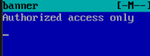

сохраняем и закрываем файл

перезапускаем службу “sshd”

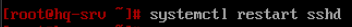
Добавляем в автозагрузку:

## **systemctl enable sshd**

проверяем внесенные изменения

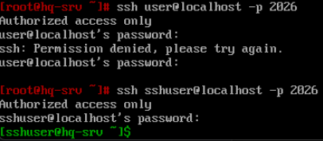
BR-SRV:

**Повторяем все то же самое, что и на HQ-SRV.**

## Задание 6. Между офисами HQ и BR, на маршрутизаторах HQ-RTR и BR-RTR необходимо сконфигурировать ip туннель

• На выбор технологии GRE или IP in IP

будет использован GRE туннель

HQ-RTR:

для поднятия туннеля необходимо открыть файл настройки сетевых интерфейсов и создать интерфейс тунелля “gre1”

## **nano /etc/network/interfaces**

и в конец файла добавляем следующие строки

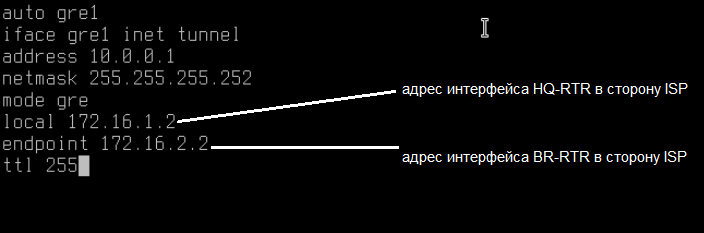
затем сохраняем файл и перезапускаем сетевую службу

## **systemctl restart networking**

проверить наличие созданного интерфейса можно командой

**ip -br a**

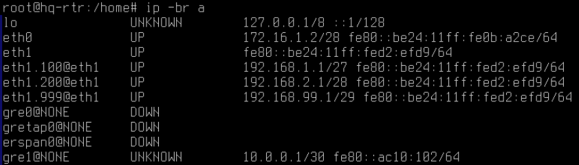

BR-RTR:

Проделываем те же самые действия, только меняем местами адреса и задаем второй адрес в подсети туннеля.

Открываем файл настройки сетевых интерфейсов

## **nano /etc/network/interfaces**

после чего вписываем в конец файла данные строки

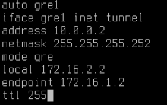
затем сохраняем файл и перезапускаем сетевую службу

## **systemctl restart networking**

проверить наличие созданного интерфейса можно командой

## **ip -br a**

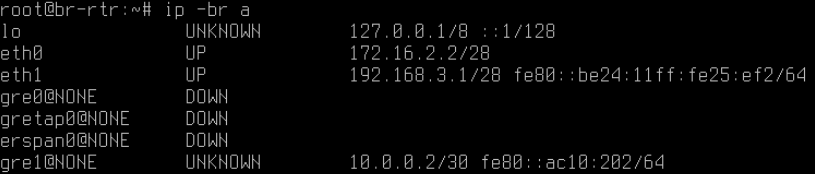
Также можно проверить связь с другим роутером, в случае успеха удаленный роутер будет отвечать на пинг запросы

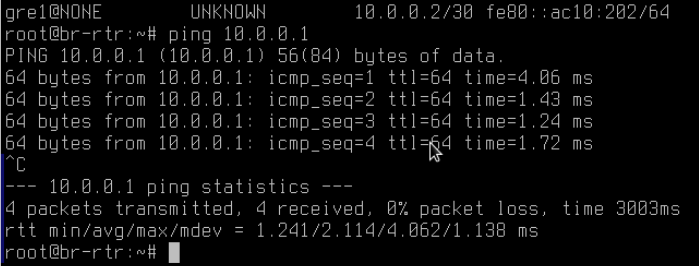

## Задание 7. Обеспечьте динамическую маршрутизацию на маршрутизаторах HQ-RTR и BR-RTR: сети одного офиса должны быть доступны из другого офиса и наоборот.

Для обеспечения динамической маршрутизации используйте link state протокол на усмотрение участника:

• Разрешите выбранный протокол только на интерфейсах ip туннеля

• Маршрутизаторы должны делиться маршрутами только друг с другом

• Обеспечьте защиту выбранного протокола посредством парольной защиты

Для динамической маршрутизации будет реализован OSPF протокол с помощью пакета FRR.

BR-RTR:

Для начала нужно указать DNS-сервер для корректной работы установщика apt

Затем необходимо подключить debian-репозиторий для установки пакета frr.

чтобы это сделать, необходимо добавить репозиторий в sources.list, открываем файл с помощью nano

## **nano /etc/apt/sources.list**

и добавляем следующую строку

После чего сохраняем файл и выполняем

## **apt update**

****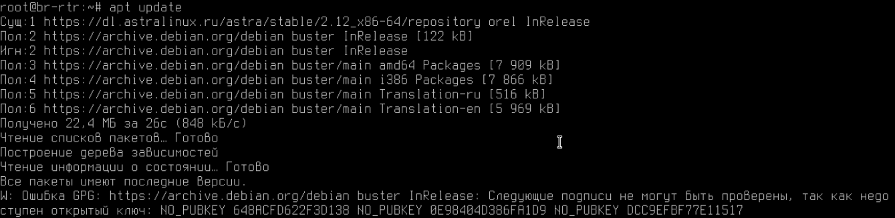

После уже можно устанавливать пакет frr

## **apt install frr -y**

Далее для активации ospf протокола необходимо активировать его демон

## **nano /etc/frr/daemons**

находим строку **ospfd=no **и переводим её в значение **yes**

****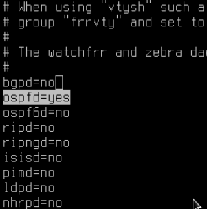

после чего перезапускаем сервис frr и добавляем его в автозапуск

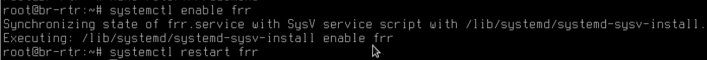
далее входим в интерфейс frr

**vtysh**

после чего для настройки ospf вводим все команды со скриншота

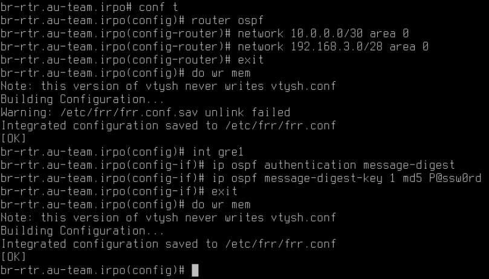
после для выхода из интерфейса frr пишем

## **quit**

## **exit**

HQ-RTR:

Для начала нужно указать DNS-сервер для корректной работы установщика apt

Затем необходимо подключить debian-репозиторий для установки пакета frr.

чтобы это сделать, необходимо добавить репозиторий в sources.list, открываем файл с помощью nano

## **nano /etc/apt/sources.list**

и добавляем следующую строку

После чего сохраняем файл и выполняем

## **apt update**

****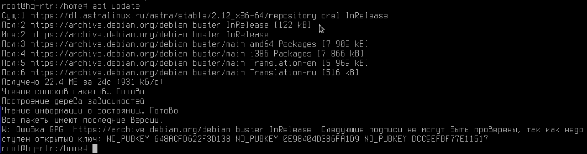

После уже можно устанавливать пакет frr

## **apt install frr -y**

Далее для активации ospf протокола необходимо активировать его демон

## **nano /etc/frr/daemons**

находим строку **ospfd=no **и переводим её в значение **yes**

****

после чего перезапускаем сервис frr и добавляем его в автозапуск

****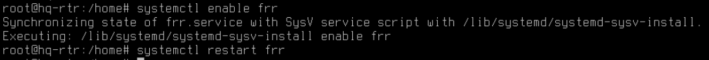

далее входим в интерфейс frr

## **vtysh**

после чего для настройки ospf вводим все команды со скриншота

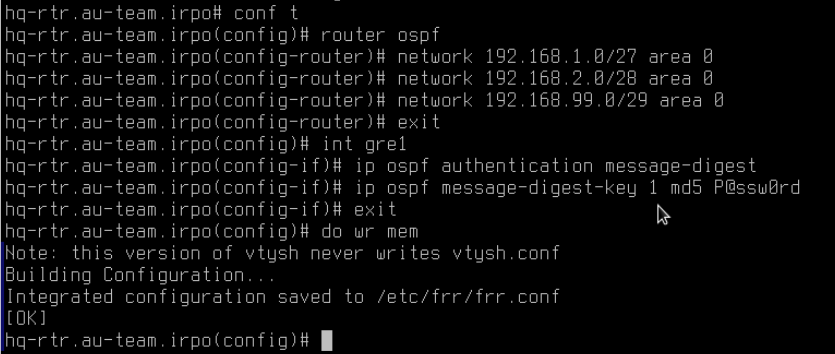
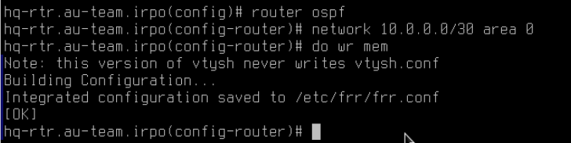
проверить полученные маршруты можно с помощью команды окружения frr

## **do show ip ospf route**

****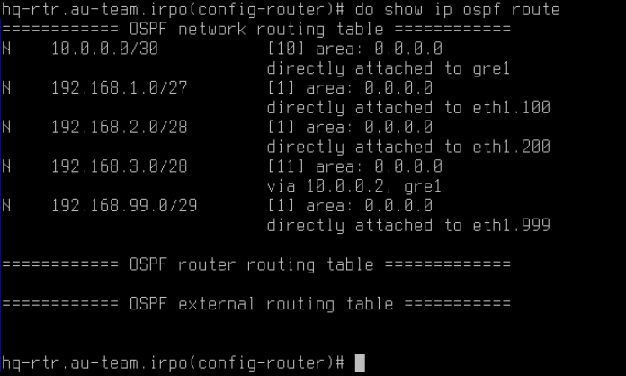

## Задание 8. Настройка динамической трансляции адресов маршрутизаторах HQ-RTR и BR-RTR:

• Настройте динамическую трансляцию адресов для обоих офисов в

сторону ISP, все устройства в офисах должны иметь доступ к сети

Интернет

**HQ-RTR**

для перекидывания пакетов между интерфейсами нужно произвести следующие операции

открываем sysctl.conf

## **nano /etc/sysctl.conf**

и добавляем в конец файла следующую строку

## **net.ipv4.ip_forward=1**

сохраняем файл и применяем введенное

## **sysctl -p**

далее настроим NAT

**iptables -t nat -A POSTROUTING -o eth0 -j MASQUERADE**

Реализуем автозагрузку созданных правил

## **iptables-save > /etc/rules.v4**

после ввода данной команды открываем crontab следующей командой

## **crontab -e**

**Будет предложен выбор текстового редактора пишем 1 и нажимаем Enter**

добавляем в конец файла следующую строки:

**BR-RTR**

для перекидывания пакетов между интерфейсами нужно произвести следующие операции

открываем sysctl.conf

## **nano /etc/sysctl.conf**

и добавляем в конец файла следующую строку

## **net.ipv4.ip_forward=1**

сохраняем файл и применяем введенное

**sysctl -p**

далее настроим NAT

**iptables -t nat -A POSTROUTING -o eth0 -j MASQUERADE**

Реализуем автозагрузку созданных правил

## **iptables-save > /etc/rules.v4**

после ввода данной команды открываем crontab следующей командо

## **crontab -e**

**Будет предложен выбор текстового редактора пишем 1 и нажимаем Enter**

добавляем в конец файла следующую строки:

## Задание 9. Настройте протокол динамической конфигурации хостов для сети в сторону HQ-CLI:

• Настройте нужную подсеть

• В качестве сервера DHCP выступает маршрутизатор HQ-RTR

• Клиентом является машина HQ-CLI

• Исключите из выдачи адрес маршрутизатора

• Адрес шлюза по умолчанию – адрес маршрутизатора HQ-RTR

• Адрес DNS-сервера для машины HQ-CLI – адрес сервера HQ-SRV

• DNS-суффикс – au-team.irpo

• Сведения о настройке протокола занесите в отчёт.

Для динамической выдаче адресов будет использован isc-dhcp-server:

HQ-RTR:

## **apt-get update && apt-get install -y isc-dhcp-server**

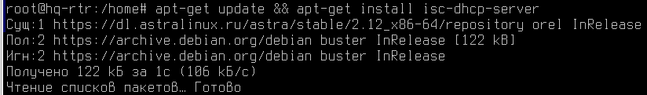
Первым делом отметим порт от которого у нас будет выдаваться dhcp. Для этого необходимо изменить файл /etc/default/isc-dhcp-server

## **nano /etc/default/isc-dhcp-server**

Его содержимое:

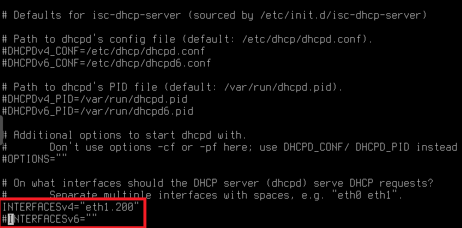
Перед настройкой конфигурационного файла сохраним его копию, для этого введем следующие команды:

## **cp /etc/dhcp/dhcpd.conf /etc/dhcp/dhcpd.bkp**

Так, теперь перейдем к изменению конфигурационного файла:

## **nano /etc/dhcp/dhcpd.conf**

Приведём к виду как на следующих скриншотах:

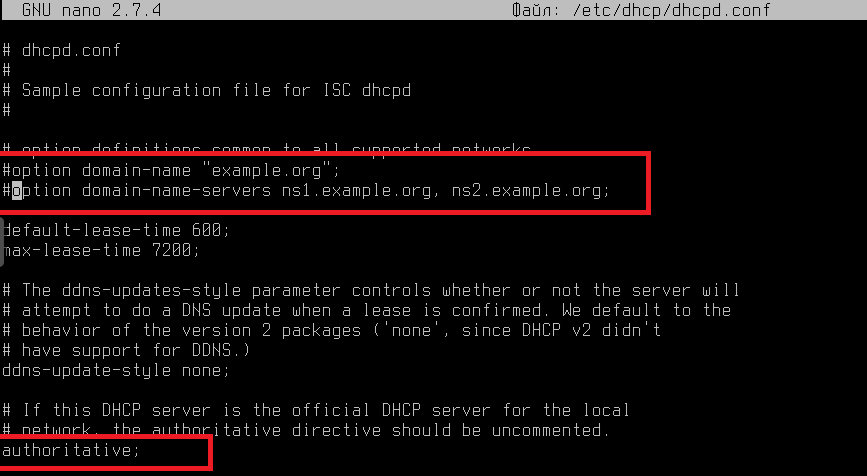

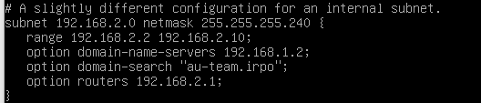

Когда мы изменили файл для этого вида, идём дальше.

## **systemctl restart isc-dhcp-server**

HQ-CLI:

Перезагружаем компьютер и смотрим на выданный ip-адрес:

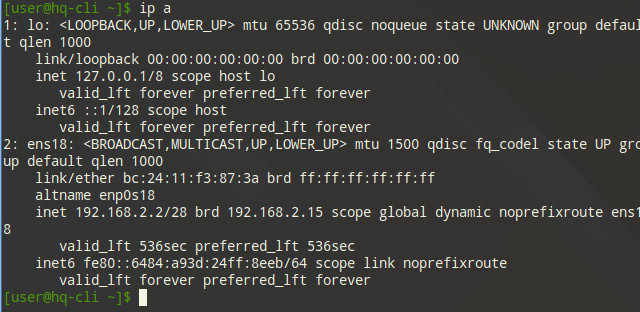
Пинг внешних источников будет работать, а домен нет т.к у нас не настроен DNS-Server на HQ-SRV. Перейдем к его настройке.

## Задание 10.Настройте инфраструктуру разрешения доменных имён для офисов HQ и BR:

• Основной DNS-сервер реализован на HQ-SRV

• Сервер должен обеспечивать разрешение имён в сетевые адреса

устройств и обратно в соответствии с таблицей 3

• В качестве DNS сервера пересылки используйте любой общедоступный

DNS сервер(77.88.8.7, 77.88.8.3 или другие)

### ## **Устройство**

**## **Запись****: ## **Тип**

### HQ-RTR

**hq-rtr.au-team.irpo**: A,PTR

### BR-RTR

**br-rtr.au-team.irpo**: A

### HQ-SRV

**hq-srv.au-team.irpo**: A,PTR

### HQ-CLI

**hq-cli.au-team.irpo**: A,PTR

### BR-SRV

**br-srv.au-team.irpo**: A

### ISP (интерфейс направленный в сторону HQ-RTR)

**docker.au-team.irpo**: A

### ISP  (интерфейс направленный в сторону BR-RTR)

**web.au-team.irpo**: A

HQ-SRV:

## **apt-get update && apt-get install -y dnsmasq**

После установки вставляем в конец конфигурационного файла /etc/dnsmasq.conf следующее содержимое:

Далее во избежание конфликтов необходимо отключить DNS службу BIND

## **systemctl disable bind --now**

****

И далее перезапускаем службу dnsmasq

## **systemctl restart dnsmasq**

## **systemctl enable dnsmasq --now**

Настройка DNS произведена

## **systemctl status dnsmasq**

Проверка:

11.Настройте часовой пояс на всех устройствах (за исключением виртуального коммутатора, в случае его использования) согласно месту проведения экзамена

**timedatectl set-timezone Asia/Yekaterinburg** (или любой другой город, доступные timezones можно посмотреть командой **timedatectl list-timezones**)

ISP:

HQ-RTR:

BR-RTR:

HQ-SRV:

HQ-CLI:

BR-SRV:

## **Модуль 2. Организация сетевого администрирования**

## Задание 1. Настройте контроллер домена Samba DC на сервере BR-SRV:

• Имя домена au-team.irpo

BR-SRV:

для начала необходимо обновить списки пакетов репозиториев командой

## **apt-get update**

Затем устанавливаем пакет контроллера домена samba

## **apt-get install task-samba-dc -y**

После установки необходимо удалить стандартный конфигурационный файл samba

## **rm -rf /etc/samba/smb.conf**

Далее запускаем утилиту создания контроллера домена

## **samba-tool domain provision**

Параметры должны соответствовать следующим значениям:

## **Realm: AU-TEAM.IRPO**

## **Domain: AU-TEAM**

## **Server Role: dc**

## **DNS backend: SAMBA_INTERNAL**

## **DNS forwarder IP address: 192.168.1.2**

Далее для корректной работы Samba DC нам понадобится скопировать конфигурационный файл krb5.conf в корневую папку /etc/ для корректной аутентификации

путь Kerberos файла необходимо брать из вывода процесса генерации домена и будет помечен как

“**A Kerberos configuration**”

****

## **cp /var/lib/samba/private/krb5.conf /etc/krb5.conf**

****

перед запуском службы необходимо отключить службу BIND

## **systemctl disable bind --now**

****

далее добавляем службу samba в автозапуск

## **systemctl enable samba --now**

****

Чтобы избежать конфликтов DNS нужно настроить  работу домена на определенный интерфейс. Для этого изменяем конфигурационный файл /etc/samba/smb.conf

## **mcedit /etc/samba/smb.conf**

Добавляем в блок [global] следующие строки:

## **interfaces = lo ens18**

## **bind interfaces only = yes**

По итогу файл должен иметь следующий вид

После сохраняем и закрываем файл. Перезагружаем службу samba

## **systemctl restart samba**

Для проверки конфигурации созданного домена выполняем команду:

## **samba-tool domain info 127.0.0.1 **

## **или**

## **samba-tool domain info 192.168.3.2**

****

Теперь необходимо добавить адрес Samba-сервера в конфигурацию dnsmasq на HQ-SRV для перенаправления всех доменных запросов на BR-SRV.

HQ-SRV:

Открываем файл конфигурации /etc/dnsmasq.conf

## **mcedit /etc/dnsmasq.conf**

И добавляем следующую строку:

## **server=/au-team.irpo/192.168.3.2**

****

В итоге файл имеет следующий вид

Сохраняем файл и перезагружаем службу dnsmasq

## **systemctl restart dnsmasq**

• Введите в созданный домен машину HQ-CLI

HQ-CLI:

Для подключения клиентской машины HQ-CLI к созданному домену нам необходимо открыть панель конфигурации компьютером, а именно alterator. В консоли вводим команду от root-пользователя

## **acc**

Или же можно открыть его через меню пуск

В меню пуск ищем пункт “Центр управления”

Далее в категории “Администрирование” кликаем по иконке “Центр управления системой”

Вводим пароль от root-пользователя

****

Затем в разделе “Пользователи” кликаем на иконку “Аутентификация”

После выбираем пункт “Домен Active Directory” и заполняем поле домена

## **Домен: au-team.irpo**

Снизу ставим флажок “Восстановить файлы конфигурации по умолчанию”

Далее в появившемся окне вводим созданный при развертывании контроллера домена пароль и тыкаем “ОК”

В случае успеха появится вот-такое окно!

• Создайте 5 пользователей для офиса HQ: имена пользователей формата

hquser№ (например hquser1, hquser2 и т.д.)

• Создайте группу hq, введите в группу созданных пользователей

BR-SRV:

Для создания пользователей воспользуемся командой

## **samba-tool user create hquser(№) P@ssw0rd**

можно проверить список пользователей командой

## **samba-tool user list**

Далее создаем hq группу командой

## **samba-tool group add hq**

И добавляем в нее созданных до этого пользователей

### **samba-tool group addmembers hq hquser1,hquser2,hquser3,hquser4,hquser5**

****

• Убедитесь, что пользователи группы hq имеют право аутентифицироваться на HQ-CLI

HQ-CLI:

Перезагружаем компьютер и пробуем войти в учетную запись созданного ранее пользователя

Вводим пароль **P@ssw0rd**

При успешной авторизации откроется рабочий стол, открыв консоль на котором и введя команду id

## **id**

Можно посмотреть информацию о пользователе

• Пользователи группы hq должны иметь возможность повышать привилегии для выполнения ограниченного набора команд: cat, grep, id. Запускать другие команды с повышенными привилегиями пользователи группы права не имеют.

HQ-CLI:

Открываем файл /etc/sudoers от имени root-пользователя

## **nano /etc/sudoers**

и добавляем туда следующую строку

после чего сохраняем файл и выходим

Меняем права на sudo файл, разрешая пользователям его выполнение

## **chmod 4755 /usr/bin/sudo**

Далее и авторизуемся с аккаунта hquser1 (или любого другого пользователя группы hq) и выполняем команду

## **sudo -l**

****

В выводе можно увидеть все доступные нам команды, для проверки выполним

## **sudo id**

## Задание 2. Сконфигурируйте файловое хранилище на сервере HQ-SRV

• При помощи двух подключенных к серверу дополнительных дисков

размером 1 Гб сконфигурируйте дисковый массив уровня 0

• Имя устройства – md0, при необходимости конфигурация массива

размещается в файле /etc/mdadm.conf

• Создайте раздел, отформатируйте раздел, в качестве файловой системы

используйте ext4

• Обеспечьте автоматическое монтирование в папку /raid

HQ-SRV:

Для начала нужно подключить пару дисков по 1Гб к машине для дальнейшего их объединения в RAID 0.

Диски можно подключить к машине пройдя по следующему пути в proxmox

После добавления дисков, подключаемся к консоли и выполняем команду для просмотра имеющихся дисков

**lsblk**

Как видно по выводу, два наших подключенных диска именуются как sdb и sdc. Для создания RAID-массива будет использоваться утилита **mdadm**

### **mdadm --create /dev/md0 --level=0 --raid-device=2 /dev/sdb /dev/sdc**

****

Был создан RAID массив и определен как устройство md0. Сейчас необходимо сохранить настройки созданного массива в файл /etc/mdadm.conf

## **mdadm --detail --scan > /etc/mdadm.conf**

С помощью cat можно посмотреть что настройки были успешно сохранены

Для работы с массивом его нужно разметить. Для этого используем утилиту fdisk

## **fdisk /dev/md0**

****

После выполнения команды запустится утилита, где нужно будет ввести следующие команды

**n **(создание нового раздела на диске)

**p **(создание основного раздела)

Следующие 3 значения оставляем по умолчанию

После успешного создания новой партиции (раздела), нажимаем **w **для записи изменений

Проверим созданный раздел командой

## **lsblk /dev/md0**

****

Из вывода видно, что был создан раздел с названием **/dev/md0p1**. Форматируем раздел в файловую систему ext4 используя утилиту mkfs

## **mkfs.ext4 /dev/md0p1**

****

Раздел отформатирован. Далее необходимо настроить автоматическое монтирование директории /raid создаем директорию

## **mkdir /raid**

Монтируем в эту папку наш дисковый массив командой

## **mount /dev/md0p1 /raid**

Используем lsblk для проверки

В выводе видно что наш RAID-массив смонтировался в папку /raid. Для настройки автоматического монтирования при загрузке системы будем использовать systemd. Для начала создадим systemd-unit с названием raid.mount

## **export EDITOR=mcedit**

## **systemctl --force --full edit raid.mount**

После чего откроется пустой файл в текстовом редакторе mcedit, который нужно будет довести до следующего вида

После сохраняем и закрываем файл

Добавляем наш юнит в автозагрузку

## **systemctl enable raid.mount --now**

Перемонтируем все файловые системы командой

## **mount -a**

Проверим точку монтирования RAID-массива командой

## **df -h**

****

В выводе в столбце “Mounted on” для нашего массива указана директория /raid. Настройка выполнена

## Задание 3. Настройте сервер сетевой файловой системы (nfs) на HQ-SRV:

• В качестве папки общего доступа выберите /raid/nfs, доступ для чтения

и записи исключительно для сети в сторону HQ-CLI

HQ-SRV:

Обновляем списки пакетов репозиториев

## **apt-get update**

****

Скачиваем пакет nfs-сервер для последующего развертывания

## **apt-get install nfs-server -y**

Создаем требуемую директорию

## **mkdir /raid/nfs**

Выдаем полные права для этой директории

## **chmod 777 /raid/nfs**

Переходим к настройке nfs сервера. Открываем конфигурационный файл

## **mcedit /etc/exports**

Добавляем в файл следующую строку

Сохраняем и закрываем файл, применяем конфигурацию командой

## **exportfs -a**

Активируем nfs-сервер и добавляем его в автозапуск

## **systemctl enable nfs-server --now**

• На HQ-CLI настройте автомонтирование в папку /mnt/nfs

HQ-CLI:

Обновляем списки пакетов репозиториев

## **apt-get update**

И скачиваем nfs-клиента на hq-cli

## **apt-get install nfs-clients -y **

Далее необходимо настроить автоматическое монтирование сетевой папки.

Создадим директорию /mnt/nfs.

## **mkdir /mnt/nfs**

Монтирование будем осуществлять средствами systemd. Создадим юнит

mnt-nfs.mount (заменяем '/' на '-' в названии) командой

## **systemctl --force --full edit mnt-nfs.mount**

Доводим файл до следующего вида

Сохраняем и закрываем конфигурацию, после чего активируем созданный юнит

systemctl enable mnt-nfs.mount --now

Перемонтируем все файловые системы командой

## **mount -a**

Проверяем точку монтирования сетевой папки командой

## **df -h**

****

Как видно из вывода, сетевая папка смонтировалась корректно. Попробуем создать в ней файл с помощью смонтированной директории.

## **touch /mnt/nfs/test**

****

Проверяем наличие созданного файла на HQ-SRV

## **ls -lah /raid/nfs**

****

Как видно созданный файл отображается на сервере, значит служба nfs работает корректно!

## Задание 4. Настройте службу сетевого времени на базе сервиса chrony на маршрутизаторе ISP:

• Вышестоящий сервер ntp на маршрутизаторе ISP - на выбор участника

• Стратум сервера - 5

• В качестве клиентов ntp настройте: HQ-SRV, HQ-CLI, BR-RTR, BR-SRV.

ISP:

Устанавливаем chrony:

## **apt-get update && apt-get install chrony**

Так, далее открываем конфигурационный файл:

## **nano /etc/chrony/chrony.conf**

Комментируем старый ntp:

И в конец файла пишем:

Перезагружаем службу chronyd для применения изменений:

## **systemctl restart chronyd**

Проверяем:

BR-RTR:

На роутерах для настройки синхронизации времени будем использовать службу chrony

## **apt-get update && apt-get install chrony**

## **nano /etc/chrony/chrony.conf**

Комментируем следующие строки:

****

В конце прописываем:

## **server 172.16.1.1 iburst**

****

Сохраняем chrony.conf

Перезагружаем и добавляем в автозагрузку chrony:

## **systemctl restart chrony**

## **systemctl enable chrony**

Проверка:

## **chronyc sources**

****

HQ-SRV:

На роутерах для настройки синхронизации времени будем использовать службу chrony

## **mcedit /etc/chrony.conf**

Комментируем строки c rtcsync и pool:

****

В конце прописываем:

## **server 172.16.1.1 iburst**

****

Сохраняем chrony.conf

Проверка:

## **chronyc sources**

****

HQ-CLI:

На роутерах для настройки синхронизации времени будем использовать службу chrony

## **mcedit /etc/chrony.conf**

Комментируем строки c rtcsync и pool:

****

В конце прописываем:

## **server 172.16.1.1 iburst**

****

Сохраняем chrony.conf

Перезагружаем chrony:

**systemctl restart chronyd**

Проверка:

## **chronyc sources**

****

BR-SRV:

На роутерах для настройки синхронизации времени будем использовать службу chrony

## **mcedit /etc/chrony.conf**

## **Комментируем строки c rtcsync и pool:**

****

В конце прописываем:

## **server 172.16.1.1 iburst**

****

Сохраняем chrony.conf

Перезагружаем chrony:

**systemctl restart chronyd**

Проверка:

## **chronyc sources**

****

Всё NTP успешно настроен.

## Задание 5. Сконфигурируйте ansible на сервере BR-SRV:

• Сформируйте файл инвентаря, в инвентарь должны входить HQ-SRV,

HQ-CLI, HQ-RTR и BR-RTR

• Рабочий каталог ansible должен располагаться в /etc/ansible

• Все указанные машины должны без предупреждений и ошибок отвечать

pong на команду ping в ansible посланную с BR-SRV.

BR-SRV:

Необходимо установить пакет ansible и sshpass выполнить это можно следующей командой:

## **apt-get update && apt-get install -y ansible sshpass**

Приведём файл инвентаря ansible к следующему виду, отредактировав конфигурационный файл по пути /etc/ansible/hosts:

## **mcedit /etc/ansible/hosts**

Редактируем файл **/etc/ansible/ansible.cfg**, приводя его к следующему виду:

Проверяем:

## **ansible all -m ping**

Мы видим что ping:pong SUCCESS на HQ-CLI не робит, так как на нём не настроен ssh. Нам необходимо настроить его.

HQ-CLI:

apt-get update && apt-get install openssh

Далее:

systemctl enable –now sshd

BR-SRV:

****

## Задание 6. Разверните веб приложение в docker на сервере BR-SRV:

• Средствами docker должен создаваться стек контейнеров с веб

приложением и базой данных

• Используйте образы site_latest и mariadb_latest располагающиеся в директории docker в образе Additional.iso

• Основной контейнер testapp должен называться tespapp

• Контейнер с базой данных должен называться db

• Импортируйте образы в docker, укажите в yaml файле параметры подключения к СУБД, имя БД - testdb, пользователь test с паролем P@ssw0rd, порт приложения 8080, при необходимости другие параметры

• Приложение должно быть доступно для внешних подключений через порт 8080

BR-SRV:

Перед началом работы необходимо отключить службу ahttpd (Alterator WWW frontent server) активный по умолчанию для настройки серверных OC ALT linux из веб-пространства.

## **systemctl disable ahttpd --now**

Для начала нужно установить пакеты docker-engine и docker-compose

## **apt-get install docker-engine docker-compose -y**

****

После установки добавим службу docker в автозагрузку командой

## **systemctl enable docker --now**

И убедимся, что служба активна командой

## **systemctl status docker**

Для дальнейшего выполнения нам потребуются подключить диск Additional.iso, подключение происходит по пути ниже. Скачать диск можно по [**ссылке**](https://disk.yandex.ru/d/0MGlkrp2B9nXDw)

После того как вы подключили диск, нужно перезапустить машину! (Или если вы смонтировали диск и там были какие-то непонятные файлы). После установки диск должен обозначаться белой надписью

Создаем директорию для монтирования

## **mkdir /dev/add_cd**

Монтируем подключенный диск

## **mount /dev/sr0 /mnt/add_cd**

И посмотрим его содержание

## **ls /mnt/add_cd**

Нам необходима директория “docker”. Скопируем её на основной диск в директорию /root

## **cp -r /mnt/add_cd/docker /root**

Просмотрим содержимое скопированной директории командой

## **Is -lah docker/**

В текстовом файле readme.txt содержатся описание веб-приложения, базы данных, используемых переменных окружения и портов, которые нужны для написания compose-файла.

Будут использованы образы веб приложения site_latest.tar и БД mariadb_latest.tar. Импортируем данные образы в docker

## **docker image load -i /root/docker/site_latest.tar**

## **docker image load -i /root/docker/mariadb_latest.tar**

****

Проверим установленные образы командой

## **docker images**

****

Для хранения файлов веб-приложения создадим директорию и перейдем в неё

## **mkdir testapp**

## **cd testapp**

Создаем файл docker-compose.yaml, описывающий стек контейнеров для их развертывания

## **mcedit docker-compose.yaml**

Вносим в файл следующие строки (в качестве отступа используется два пробела, не табуляция):

****

Сохраняем изменения и закрываем файл, теперь находясь в одной директории с файлом docker-compose.yaml, можно запустить стек контейнеров командой

## **docker compose up -d**

Проверить работающие контейнеры можно командой

## **docker ps**

В выводе отображаются 2 работающих контейнера, с веб-приложением и БД. Для проверки переходом на HQ-CLI, открываем браузер и вводим адрес сервер

HQ-CLI:

## **http://192.168.3.2:8080**

После чего открывается сайт, на котором представлено тестовое приложение. Для проверки работы можно создать тестовую запись

****

Как видно, docker приложение работает корректно, осталось добавить его в автозагрузку посредством cron. Для этого вводим следующие команды

## **export EDITOR=mcedit**

## **crontab -e**

Открывается файл таблицы с задачами, куда мы добавляем следующую строку (после строки необходимо нажать enter (пустая строка обязательна))

На этом пункт закончен!

## Задание 7. Разверните веб приложение на сервере HQ-SRV:

• Используйте веб-сервер apache

• В качестве системы управления базами данных используйте mariadb

• Файлы веб приложения и дамп базы данных находятся в директории web

образа Additional.iso

• Выполните импорт схемы и данных из файла dump.sql в базу данных

webdb

• Создайте пользователя web с паролем P@ssw0rd и предоставьте ему

права доступа к этой базе данных

• Файлы index.php и директорию images скопируйте в каталог веб сервера

apache

• В файле index.php укажите правильные учётные данные для

подключения к БД

• Запустите веб сервер и убедитесь в работоспособности приложения

• Основные параметры отметьте в отчёте

## **HQ-SRV:**

Установить метапакет который содержит в себе всё необходимое для работы стека LAMP (Linux+Apache+MariaDB+PHP):

## **apt-get update && apt-get install –y lamp-server**

Для дальнейшего выполнения нам потребуются подключить диск Additional.iso, подключение происходит по пути ниже. Скачать диск можно по [**ссылке**](https://disk.yandex.ru/d/0MGlkrp2B9nXDw)

После того как вы подключили диск, нужно перезапустить машину! (Или если вы смонтировали диск и там были какие-то непонятные файлы). После установки диск должен обозначаться белой надписью

Монтируем подключенный диск

## **mount /dev/sr0 /mnt/**

И посмотрим его содержание

## **ls /mnt/**

****

Нам необходима директория “web”. Скопируем из неё index.php и logo.png в директорию /var/www/html

## **cp /mnt/web/index.php /var/www/html**

## **cp /mnt/web/logo.png /var/www/html**

В файле /var/www/html/index.php указать правильные учётные данные для подключения к БД:

## **mcedit /var/www/html/index.php**

Приведите к следующему ввиду файл /etc/httpd2/conf/sites-available/default.conf:

## **mcedit /etc/httpd2/conf/sites-available/default.conf**

Включить и добавить в автозагрузку службу **mariadb.**

## **systemctl enable --now mariadb**

Перейти в интерфейс управления MariaDB:

## **mariadb –u root**

Создать базу данных с именем webdb:

## **CREATE DATABASE webdb;**

Создать пользователя web с паролем P@ssw0rd:

## **CREATE USER ‘web’@’localhost’ IDENTIFIED BY ‘P@ssw0rd’;**

Назначить пользователю web полные права на базу данных webdb, после чего выйти из интерфейса управления MariaDB:

### **GRANT ALL PRIVILEGES ON webdb.* TO ‘web’@’localhost’ WITH GRANT OPTION;**

Выходим:

## **EXIT;**

Выполнить импорт схемы и данных из файла dump.sql в базу данных webdb:

## **mariadb –u web –p –D webdb < /mnt/web/dump.sql**

Выполнить импорт схемы и данных из файла **dump.sql** в базу данных **webdb**:

**mariadb –u web –p –D webdb < /mnt/web/dump.sql**

Проверить:

Включить и добавить в автозагрузку службу httpd2:

## **systemctl enable --now httpd2**

Проверяем доступ до веб приложения с браузера на HQ-CLI:

## Задание 8. На маршрутизаторах сконфигурируйте статическую трансляцию портов

Пробросьте порт 8080 в порт приложения testapp BR-SRV на маршрутизаторе BR-RTR, для обеспечения работы приложения testapp извне.

Пробросьте порт 2026 на маршрутизаторе BR-RTR в порт 2026 сервера BR-SRV, для подключения к серверу по протоколу ssh из внешних сетей

BR-RTR:

Для проброса портов будет использоваться утилита iptable. Необходимо задать следующее правило

### **iptables -t nat -A PREROUTING -d 172.16.2.2 -p tcp --dport 8080 -j DNAT --to-destination 192.168.3.2:8080**

### **iptables -t nat -A PREROUTING -d 172.16.2.2 -p tcp --dport 2026 -j DNAT --to-destination 192.168.3.2:2026**

Сохраняем нынешнюю конфигурацию в ранее созданный файлик /etc/rules.v4

## **iptables-save > /etc/rules.v4**

Пробросьте порт 8080 в порт веб приложения на HQ-SRV на маршрутизаторе HQ-RTR, для обеспечения работы веб приложения извне

Пробросьте порт 2026 на маршрутизаторе HQ-RTR в порт 2026 сервера HQ-SRV, для подключения к серверу по протоколу ssh из внешних сетей

**iptables -t nat -A PREROUTING -d 172.16.1.2 -p tcp --dport 8080 -j DNAT --to-destination 192.168.1.2:80**

**iptables -t nat -A PREROUTING -d 172.16.1.2 -p tcp --dport 2026 -j DNAT --to-destination 192.168.1.2:2026**

Сохраняем нынешнюю конфигурацию в ранее созданный файлик /etc/rules.v4

**iptables-save > /etc/rules.v4**

## Задание 9. Настройте веб-сервер nginx как обратный прокси-сервер на ISP

При обращении по доменному имени web.au-team.irpo у клиента должно

открываться веб приложение на HQ-SRV

При обращении по доменному имени docker.au-team.irpo клиента

должно открываться веб приложение testapp

ISP:

Установить пакет nginx:

## **apt-get update && apt-get install -y nginx**

Настроить nginx как реверсивный прокси сервер, приведя файл /etc/nginx/sites-available/default к следующему виду:

## **nano /etc/nginx/sites-available/default**

****

Проверить наличие ошибок в конфигурационных файлах:

Запустить и активировать службу nginx:

## **systemctl enable --now nginx**

Проверка:

http://web.au-team.irpo

http://docker.au-team.irpo

## Задание 10. На маршрутизаторе ISP настройте web-based аутентификацию

• При обращении по доменному имени web.au-team.irpo у клиента должно

открываться веб приложение на HQ-SRV

• При обращении по доменному имени docker.au-team.irpo клиента

должно открываться веб приложение testapp

## **ISP:**

Установить пакет apache2-utils:

## **apt-get install -y apache2-utils**

Средствами утилиты htpasswd создать пользователя WEB и добавить информацию о нём в файл /etc/nginx/.htpasswd, задав пароль P@ssw0rd:

Добавить web-based аутентификацию для доступа к сайту web.au-team.irpo в конфигурационный файл /etc/nginx/sites-available/default:

## **nano /etc/nginx/sites-available/default**

Проверить наличие ошибок в конфигурационных файлах:

Проверка:

****

****

## Задание 11.Удобным способом установите приложение Яндекс Браузер на HQ-CLI

HQ-CLI:

## **apt-get install yandex-browser-stable -y**

****

## **Модуль 3 Эксплуатация объектов сетевой инфраструктуры**

## Задание 1. Выполните импорт пользователей в домен au-team.irpo.

• В качестве файла источника выберите файл users.csv располагающийся

в образе Additional.iso

• Пользователи должны быть импортированы со своими паролями и

другими атрибутами

• Убедитесь, что импортированные пользователи могут войти на машину

HQ-CLI

BR-SRV:

Выполнить монтирование **Additional.iso** в директорию **/mnt**:

## **mount /dev/sr0/mnt/**

Файл в целом включает в себя 300 пользователей (1 строка под шапку):

1-я строка в файле - наименование основных полей (столбцов), которых 10 штук:

Помимо импорта пользователей, стоит учесть и создание необходимых OU, которых нащитывается в данном файле - 5 уникальных OU:

Создаём файл скрипта для импорта пользователей, например "**import_user.sh**":

## **mcedit import_user.sh**

скрипт может выглядеть следующим образом (один из вариантов, далеко не эталонный, но работоспособный):

## **chmod +x import_user.sh**

**./import_user.sh /mnt/Users.csv**

Результат запуска скрипта :

После запуска скрипта и ожидания завершения работы средствами samba-tool можно произвести проверку созданных OU и пользователей:

созданные OU:

созданные пользователи в OU "IT":

созданные пользователи в OU "Overal":

и так далее…

Проверить возможность входа из-под импортированным пользователем:

## Задание 2. Выполните настройку центра сертификации на базе HQ-SRV

Необходимо использовать отечественные алгоритмы шифрования

• Сертификаты выдаются на 30дней

• Обеспечьте доверие сертификату для HQ-CLI

• Выдайте сертификаты веб серверам

• Перенастройте ранее настроенный реверсивный прокси nginx на

протокол https

• При обращении к веб серверам https://web.au-team.irpo и

https://docker.au-team.irpo у браузера клиента не должно возникать

предупреждений.

HQ-SRV:

Установите пакет с поддержкой ГОСТ:

## **apt-get install -y openssl-gost-engine**

Включите поддержку ГОСТ через control-скрипт:

## **control openssl-gost enabled**

Создаём закрытый ключ с алгоритмом ГОСТ-2012 (ca.key):

### **openssl genpkey -algorithm gost2012_256 -pkeyopt paramset:TCB -out ca.key**

Создаём сертификат на 30 дней (ca.cer):

### **openssl req -new -x509 -md_gost12_256 -days 30 -key ca.key -out ca.cer**

Результат:

Проверка сертификата (ca.cer):

Создаём закрытые ключи по алгоритму ГОСТ веб-серверов:

для web.au-team.irpo:

### **openssl genpkey -algorithm gost2012_256 -pkeyopt paramset:A -out web.au-team.irpo.key**

для docker.au-team.irpo:

### **openssl genpkey -algorithm gost2012_256 -pkeyopt paramset:A -out docker.au-team.irpo.key**

Создаём запросы на подпись ранее созданном УЦ:

для web.au-team.irpo:

### **openssl req -new  -md_gost12_256 -key web.au-team.irpo.key -out web.au-team.irpo.csr**

для docker.au-team.irpo:

### **openssl req -new  -md_gost12_256 -key docker.au-team.irpo.key -out docker.au-team.irpo.csr**

Подписываем запрос в ранее созданном УЦ:

для web.au-team.irpo:

### **openssl x509 -req -in web.au-team.irpo.csr -CA ca.cer -CAkey ca.key -CAcreateserial -out web.au-team.irpo.cer -days 30**

ISP:

## **apt-get install openssh-server**

## **nano /etc/ssh/sshd_config**

Перезагружаем службу sshd для применения изменений:

## **systemctl restart sshd**

HQ-SRV:

Передаём необходимые файлы на ISP:

### **scp {web,docker}.au-team.irpo.{key,cer} root@172.16.1.1:~/**

ISP:

Проверить наличие файлов ключей и сертификатов:

Создаём каталог /etc/nginx/ssl и копируем туда файлы ключей и сертификатов:

## **mkdir /etc/nginx/ssl**

## **cp web.au-team.irpo.* /etc/nginx/ssl**

## **cp docker.au-team.irpo.* /etc/nginx/ssl**

## **nano /etc/nginx/sites-available/default**

****

Проверить наличие ошибок в конфигурационных файлах:

## **nginx -t**

Результат:

Чтобы устранить подобную ошибку и чтобы nginx в результате успешно перезапустил свою службу, необходимо установить пакет с поддержкой ГОСТ:

-----------------------------------------------------------------------------------------------------------------------------------

## **Если на ISP debian-подобная система:**

**apt-get install libengine-gost-openssl** (аналог openssl-gost-engine для debian подобных систем)

Включите поддержку ГОСТ через control-скрипт:

## **openssl engine gost -t**

Далее необходимо настроить сам openssl чтобы он мог поддерживать GOST

**nano /etc/ssl/openssl.cnf**

Настроим openssl на работу с gost-engine, для этого в конфигурационный файл /etc/ssl/openssl.cnf в глобальном разделе, перед первым заголовком раздела заключенным в квадратные скобки, добавляем:

## **openssl_conf=openssl_def**

В конец того же файла добавляем следующие параметры:

—--------------------------------------------------------------------------------------

### Если на ISP ALT подобная система

## **apt-get install -y openssl-gost-engine**

Включите поддержку ГОСТ через control-скрипт:

## **control openssl-gost enabled**

—------------------------------------------------------------------------------------------------------------------------------------

Проверка

Выведем список доступных криптографических движков, в выводе должен присутствовать GOST:

Перепроверить наличие ошибок в конфигурационных файлах:

Перезапустить службу nginx:

## **systemctl restart nginx**

HQ-SRV:

Передаём на HQ-CLI корневой сертификат УЦ (ca.cer):

## **scp ca.cer user@192.168.200.2:~/**

HQ-CLI:

Проверить наличие переданного сертификата:

Для установки корневых сертификатов необходимо поместить файлы сертификатов в /etc/pki/ca-trust/source/anchors/ и обновить общесистемный список доверенных CA (из-под суперпользователя root):

### **cp /home/user/ca.cer /etc/pki/ca-trust/source/anchors/ && update-ca-trust**

Проверить наличие сертификата в браузере:

Яндекс:

При попытке подключиться к нашим веб-ресурсам будет возникать следующая ошибка:

Решение: устанавливаем КриптоПро CSP:

Из-под суперпользователя перейти в дирректорию с распакованным архивом:

## **cd /home/user/Загрузки/linux-amd64**

Установите пакет cryptopro-preinstall:

## **apt-get install -y cryptopro-preinstall**

Запустить скрипт установки:

## **./install_gui.sh**

Выбераем Импортировать корневые сертификаты из ОС. Выбираем её через Пробел и нажимае Enter.

Можно запустить КриптоПРО SCP и проверить наличие нашего УЦ:

После чего проверить доступ до веб-ресурсов:

## **https://web.au-team.irpo:**

НО (проблемы в исходном коде приложения):

*Описанное ниже - не является призывом к действию! Просто попытка дойти до истины (редактирование запущенного контейнера - никчему хорошему не приведёт!)*

для подключения https://docker.au-team.irpo - возникают проблемы со стилями (именно при подключению по HTTPS):

если перейти в режим отладки (F12), то можно увидеть что файл стилей не может быть загружен (проблема на стороне исходного кода веб-приложения):

можем попытаться войти внутрь контейнера с нашим приложением на BR-SRV:

## **docker exec -it testapp ash**

проблема кроется в файле app/site/site.html, а именно в строке:

## **vi app/site/site.html**

Нажмите** Insert** для перехода в режим редактирования

если данную строку привести к следующему виду:

Для выхода из редактора нажмите esc, далее напишите **:wq**

****

## Задание 3. Перенастройте ip-туннель с базового до уровня туннеля, обеспечивающего шифрование трафика

Настройте защищенный туннель между HQ-RTR и BR-RTR

• Внесите необходимые изменения в конфигурацию динамической

маршрутизации, протокол динамической маршрутизации должен

возобновить работу после перенастройки туннеля

• Выбранное программное обеспечение, обоснование его выбора и его

основные параметры, изменения в конфигурации динамической

маршрутизации отметьте в отчёте.

Вариант реализации:

HQ-RTR:

## **sudo apt update**

## **sudo apt install -y strongswan strongswan-pki**

Делаем бекап файла

Далее открываем этот конфигурационный файл:

## **nano /etc/ipsec.conf**

Отключаем установку маршрутов при помощи IKE демона, т.к. маршрутизацию мы настроим далее, с помощью пакета frr.

Для этого в файле /etc/strongswan.d/charon.conf находим строку с параметром **install_routes**, раскомментируем ее и установим значение в no.

## **install_routes = no**

В файле **/etc/ipsec.conf** настроим параметры IPSec, значения left и leftsubnet используются для локальных адресов, right и rightsubnet - для удаленных.

****

Файл /etc/ipsec.secrets

На BR-RTR:

Файл /etc/ipsec.secrets

## **systemctl restart strongswan**

HQ-RTR:

## **systemctl restart strongswan-starter**

Проверить можно с помощью команды:

## **ipsec statusall**

Поздравляю трафик зашифрован!

Теперь надо починить OSPF

Для этого заходим в frr командой vtysh

## **vtysh**

и прописываем:

## **show run**

Нам  интересны строки связанные с gre.

****

Мы видим что здесь присутствует старое шифрование, его необходимо удалить, для этого вводим:

## **conf t**

## **interface gre1**

## **no ip ospf authentication message-digest**

## **no ip ospf message-digest-key 1 md5 123qweR%**

Так теперь здесь же напишем команду:

## **ip ospf network broadcast**

## **end**

## **wr**

## **exit**

## **Теперь проделываем тожесамое на BR-RTR: **

Для этого заходим в frr командой vtysh

## **vtysh**

и прописываем:

## **show run**

Нам  интересны строки связанные с gre.

****

Мы видим что здесь присутствует старое шифрование, его необходимо удалить, для этого вводим:

## **conf t**

## **interface gre1**

## **no ip ospf authentication message-digest**

## **no ip ospf message-digest-key 1 md5 123qweR%**

Так теперь здесь же напишем команду:

## **ip ospf network broadcast**

## **end**

## **wr**

## **exit**

## Задание 4. Настройте межсетевой экран на маршрутизаторах HQ-RTR и BR-RTR на сеть в сторону ISP.

• Обеспечьте работу протоколов http, https, dns, ntp, icmp или

дополнительных нужных протоколов

• Запретите остальные подключения из сети Интернет во внутреннюю

сеть.

Для настройки firewall мы будем использовать iptables:

HQ-RTR:

Отредачим ранее созданный файл(в 1 модуле) iptables до следующего вида.

## **nano /etc/rules.v4**

## **iptables-restore < /etc/rules.v4**

BR-RTR:

**nano /etc/rules.v4**Отредачим ранее созданный файл(в 1 модуле) iptables до следующего вида.

**iptables-restore < /etc/rules.v4**

## Задание 5. Настройте принт-сервер cups на сервере HQ-SRV:

• Опубликуйте виртуальный pdf-принтер

• На клиенте HQ-CLI подключите виртуальный принтер как принтер по

умолчанию.

HQ-SRV:

Установить необходимые пакеты:

## **apt-get update && apt-get install -y cups cups-pdf**

Включить и добавить в автозагрузку службу **cups**:

## **systemctl enable --now cups**

Включить общий доступ к принтеру на сервере и разрешить печатать из любой сети:

## **cupsctl --share-printers --remote-any**

HQ-CLI:
Подключаем виртуальный принтер как принтер по умолчанию:

Если предложат авторизироваться на hq-srv, нажимаем отменить!

Далее необходимо сделать его принтером по умолчанию:

Проверяем печать:

На HQ-SRV (результат печати 3-х пробных страниц):

## Задание 6. Реализуйте логирование при помощи rsyslog на устройствах HQ-RTR, BR-RTR, BR-SRV:

• Сервер сбора логов расположен на HQ-SRV, убедитесь, что сервер не

является клиентом самому себе

• Приоритет сообщений должен быть не ниже warning

• Все журналы должны находиться в директории /opt. Для каждого

устройства должна выделяться своя поддиректория, которая совпадает с

именем машины

• Реализуйте ротацию собранных логов на сервере HQ-SRV:

• Ротируются все логи, находящиеся в директории и

поддиректориях /opt

• Ротация производится один раз в неделю

• Логи необходимо сжимать

• Минимальный размер логов для ротации – 10МБ.

HQ-SRV:

## **apt-get update && apt-get install rsyslog -y **

## **systemctl enable rsyslog**

Конфигурация rsyslog.conf

## **mcedit /etc/rsyslog.d/***

Добавь (или раскомментируй) модули приёма:

В конце этого же файла добавь правила маршрутизации логов:

Создай каталоги:

## **mkdir -p /opt/HQ-RTR /opt/BR-RTR /opt/BR-SRV**

## **chown 777 /opt -R**

Перезапусти rsyslog:

## **systemctl restart rsyslog**

HQ-RTR:

Редактируй /etc/rsyslog.conf:

## **nano /etc/rsyslog.conf**

Добавь строку для отправки сообщений уровня warning и выше на HQ-SRV:

## ***.warning @@192.168.1.2:514**

## **systemctl restart rsyslog**

BR-RTR:

Редактируй /etc/rsyslog.conf:

## **nano /etc/rsyslog.conf**

Добавь строку для отправки сообщений уровня warning и выше на HQ-SRV:

## ***.warning @@192.168.1.2:514**

## **systemctl restart rsyslog**

BR-SRV:

## **apt-get update && apt-get install rsyslog -y **

## **systemctl enable rsyslog**

Конфигурация rsyslog.conf

## **mcedit /etc/rsyslog.d/***

Добавь строку для отправки сообщений уровня warning и выше на HQ-SRV:

## ***.warning @@192.168.1.2:514**

## **systemctl restart rsyslog**

Настройка ротации логов

HQ-SRV:

Создай файл:

## **mcedit /etc/logrotate.d/opt-logs**

Содержимое:

Проверка конфигурации:

## **logrotate -d /etc/logrotate.conf**

Если нет ошибки в последней строке значит всё ОК, последняя строка должна быть связана с тем что нет файлов где minsize больше 10М.

Проверка

На любом клиенте, например HQ-RTR:

## **logger -p user.warning "Test log from HQ-RTR"**

Теперь на HQ-SRV:

## **tail -f /opt/HQ-RTR/syslog.log**

Если всё корректно — сообщение появится в соответствующем логе.

## Задание 7. Насервере HQ-SRV реализуйте мониторинг устройств с помощью открытого программного обеспечения

• Обеспечьте доступность по URL - http://mon.au-team.irpo для сетей

офиса HQ, внесите изменения в инфраструктуру разрешения доменных

имён

• Мониторить нужно устройства HQ-SRV и BR-SRV

• В мониторинге должны визуально отображаться нагрузка на ЦП, объем

занятой ОП и основного накопителя

• Логин и пароль для службы мониторинга admin P@ssw0rd

• Организуйте доступ к мониторингу для HQ-CLI, без внешнего доступа

• Выбор программного обеспечения, основание выбора и основные

параметры с указанием порта, на котором работает мониторинг,

отметьте в отчёте

**Netdata** — лёгкая система мониторинга в реальном времени, идеально подходит для двух серверов, легко ставится, имеет web-интерфейс, **не требует СУБД**, показывает CPU/RAM/DISK «из коробки».

Установка Netdata на HQ-SRV

HQ-SRV:

## **sudo apt update**

## **sudo apt install -y netdata**

## **sudo systemctl enable –now netdata**

Проверить можно по адресу**http://192.168.1.2:19999**

Внесём изменения в DNS-server:

## **mcedit /etc/dnsmasq.conf**

## **systemctl restart dnsmasq**

Теперь настроим авторизацию и домен:

Устанавливаем nginx как реверс-прокси

## **apt-get install -y nginx apache2-htpasswd**

Теперь созданим файлик с паролем

## **htpasswd -cb /etc/nginx/.netdata-pass admin P@ssw0rd**

Конфигурация nginx: /etc/nginx/sites-available.d/default.conf

### **ln -s /etc/nginx/sites-available.d/default.conf /etc/nginx/sites-enabled.d/**

## **nginx -t**

## **systemctl restart nginx**

Подключение BR-SRV к системе мониторинга:

На BR-SRV:

## **sudo apt update**

## **sudo apt install -y netdata**

## **sudo systemctl enable –now netdata**

Перед всем создадим API-KEY следующим образом:

Создайте файл /etc/netdata/stream.conf:

С содержимым

На HQ-SRV:

В /etc/netdata/netdata.conf** **добавить следующие строки**:**

Создайте файл /etc/netdata/stream.conf:

С содержимым:

## **Systemctl restart netdata**

Проверка:

## Задание 8. Реализуйте механизм инвентаризации машин HQ-SRV и HQ-CLI через Ansible на BR-SRV:

• Плейбук должен собирать информацию о рабочих местах:

• Имя компьютера

• IP-адрес компьютера

• Плейбук, должен быть размещен в директории /etc/ansible, отчёты в

поддиректории PC-INFO, в формате .yml. Файлы должны называется

именем компьютера, который был инвентаризирован

• Файл плейбука располагается в образе Additional.iso в директории

playbook

BR-SRV:

Смотрим название монтируемого каталога и монтируем его в /mnt

Копируем плейбук файл из монтируемого каталога и папку с ansible

Создание папки для хранения отчётов

Открываем файл /etc/ansible/get_hostname_address.yml и заполняем его

Проверка скрипта плейбука:

## Задание 9. На HQ-SRV настройте программное обеспечение fail2ban для защиты ssh

• Укажите порт ssh

• При 3 неуспешных авторизациях адрес атакующего попадает в бан

• Бан производится на 1минуту

Установка fail2ban

## **apt-get update && apt-get install fail2ban**

Добавляем службу fail2ban в автозапуск, запускаем её и смотрим статус

## **Systemctl enable fail2ban**

## **Systemctl start fail2ban**

## **Systemctl status fail2ban**

Создаем и открываем новое правило с конфигурацией sshd

Содержимое правила

ssh — название для правила;

enabled позволяет быстро включать (true) или отключать (false) правило;

port — порт целевого сервиса. Принимается буквенное или цифирное обозначение;

filter — фильтр (критерий поиска), который будет использоваться для поиска подозрительных действий. По сути, это имя файла из каталога /etc/fail2ban/filter.d без .conf на конце;

action — действие, совершаемое в случае срабатывания правила. В квадратных скобках указаны название для правила, сетевой порт и протокол для блокирования;

logpath — расположение лог-файла, в котором фильтр будет искать подозрительную активность на основе описанных критериев.

maxretry — количество действий, которые разрешено совершить до бана.

findtime — время в секундах, в течение которого учитывается maxretry;

bantime — время, на которое будет блокироваться IP-адрес;

action — действия, которое будет выполняться, если Fail2ban обнаружит активность, соответствующую критериям поиска.

Перезагружаем daemon-reload и сервис fail2ban и смотрим статус работы клиента ssh

## Задание 10 Настройка резервного копирования директории сервера HQ-SRV:

• На HQ-SRV развернуть программное обеспечение для резервного

копирования и восстановления данных с защитой от вирусов-

шифровальщиков

• В качестве решения рекомендуется использовать программное

обеспечение Кибер Бэкап версии 17.4 или аналог

• Настройте организацию irpo

• Настройте пользователя с правами администратора на сервере

HQ-SRV, имя пользователя irpoadmin с паролем P@ssw0rd

• Установите на HQ-CLI агент с функциями узла хранилища и

подключите его к серверу управления

• На узле хранилища HQ-CLI создайте директорию /backup и

выберите её в качестве устройства хранения

• Создайте два плана резервного копирования для сервера HQ-SRV

• план для резервного копирования директории /etc и всех её

поддиректорий

• план для резервного копирования базы данных webdb типа

mysql

• Выполните резервное копирование директории /etc и всех её

поддиректорий сервера HQ-SRV на узел хранения HQ-CLI

• Выполните резервное копирование базы данных webdb сервера

HQ-SRV на узел хранения HQ-CLI

Установим дистрибутив Кибер-бакап:

На HQ-CLI:

Теперь надо перекинуть файл на HQ-SRV:

Перед установкой обязательно обновите ядро:

## **apt-get updateapt-get dist-upgradeupdate-kernel**

## **apt-get install kernel-headers-modules-std-def**

## **apt-get install gcc**

## **apt-get install make**

Перезагружаем сервер:

## **reboot**

## **И вводим **

## **apt-get install kernel-headers-modules-std-def**

## **apt-get install gcc**

## **apt-get install make**

Выдаём права на выполнение скачанного файла:

## **chmod +x /usr/sshuser/CyberBackup_17_64-bit.x86_64**

И запускаем файл установки:

## **/usr/sshuser/CyberBackup_17_64-bit.x86_64**

Принимаем условия лицензионного соглашения.

Следующим шагом выбираем компоненты, которые требуется установить:

- Сервер управления (Management server) - ядро системы, отвечает за управление планом резервного копирования агентов на клиентских системах, включает в себя веб-консоль и встроенную БД (SQLite)  - Агент для Linux (Agent for Linux)  - Мастер создания загрузочных носителей (Bootable Media Builder)  - Узел хранения (Storage Node) - отвечает за хранение резервных копий.

Выбираем систему управления базами данных для сервера управления - SQLite.

Указываем порты. Сперва тот, который будет использоваться в веб-браузере для доступа к серверу управления (по умолчанию 9877). Потом, который будет использоваться для обмена данными между компонентами программы (по умолчанию 7780).

Авторизируемся под привилегированном пользователем 

Мы попадаем в веб-интерфейс:

Настроим пользователя с правами администратора:

Для этого мы создадим пользователя:

Нажимаем добавить

Теперь вернямся на HQ-SRV и впишем имя пользователя в файл /etc/security/acronisagent.conf

mcedit **/etc/security/acronisagent.conf**

****

Проверка:

Теперь добавим Агента на HQ-CLI:

HQ-CLI:

Перед установкой обязательно обновите ядро:

## **apt-get updateapt-get dist-upgradeupdate-kernel**

## **apt-get install kernel-headers-modules-std-def**

## **apt-get install gcc**

## **apt-get install make**

Перезагружаем сервер:

## **reboot**

Добавляем права на выполнение

Запускаем:

На узле хранилища HQ-CLI создайте директорию /backup:

Теперь создадим две плана резервного копирования для сервера HQ-SRV

Для решения вопроса с лицензией необходимо её активировать для этого:

Так мы реализовали план номер 1, перейдём к плану 2 в котором нам необходимо реализовать резервное копирование БД webdb.

У меня это директория “/var/lib/mysql/db/webdb”

Так и теперь чтобы выполнить резервное копирование прямо сейчас:

Когда будет две галочки как на скриншоте, 10 задание и по совместительству 3 модуль будет завершен.

